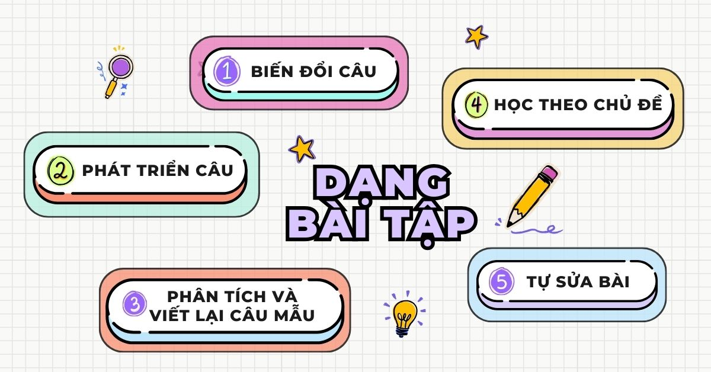
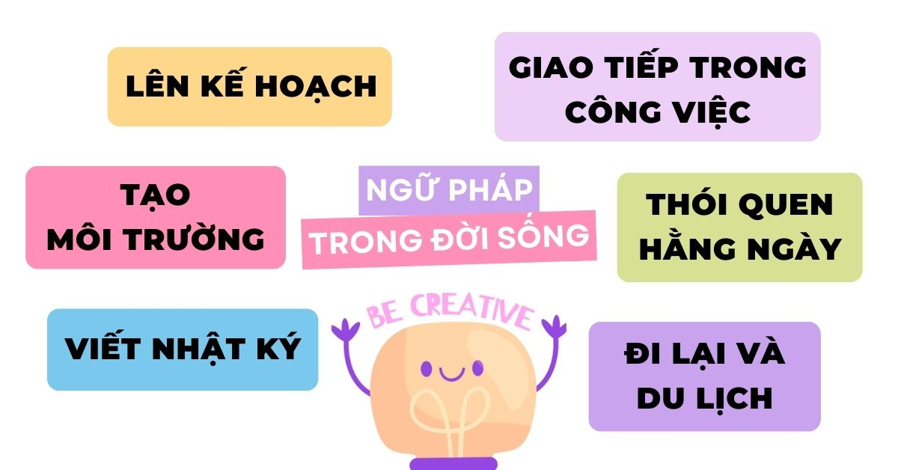

# Áp dụng Contextualized Learning vào việc học ngữ pháp tiếng Anh

Học ngôn ngữ là hành trình phức tạp, đòi hỏi sự tương tác chủ động và đối mặt với nhiều tác động khác nhau. Contextualized Learning, hay học thông qua ngữ cảnh thực tế, đóng vai trò quan trọng trong sự phát triển ngôn ngữ.

Bài viết này khám phá sự phức tạp của tương tác giữa ngữ cảnh và ngôn ngữ, và phân tích cách tín hiệu ngữ cảnh ảnh hưởng đến việc nắm bắt ngữ pháp. Ngoài ra, đề cập đến các bài thực hành cụ thể như biến đổi câu, phát triển câu, và tự sửa lỗi, giúp học viên trải nghiệm việc thực hành ngữ pháp một cách sáng tạo và thú vị.

**Key Takeaways**

---

Những khó khăn trong việc làm chủ ngữ pháp: Sự khác nhau trong cách sử dụng, ngữ pháp tiếng Việt phụ thuộc vào ngữ cảnh và tình huống, trong khi ngữ pháp tiếng Anh thiên về cấu trúc logic.

Khái niệm về Contextualized Learning: Phương pháp học tập thiên về thực hành dựa trên trải nghiệm thực tế của người học hơn là các lý thuyết suông.

**Lợi ích của việc áp dụng Contextualized Learning vào việc học ngữ pháp**

- Tăng cường khả năng ghi nhớ
- Cải thiện khả năng tiếp thu
- Tạo động lực
- Ứng dụng thực tế
- Phát triển các kỹ năng
- Kết nối văn hóa
- Phương pháp học linh hoạt theo nhu cầu
- Tư duy phê phán

**Phương pháp áp dụng Contextualized Learning trong việc học ngữ pháp**

- Học theo chủ đề
- Trong đời sống hằng ngày
- Kết hợp tất cả các kỹ năng

**Một số dạng bài thực hành Contextualized Learning cụ thể khi học ngữ pháp tại lớp:**

- Bài tập biến đổi câu
- Bài tập phát triển câu
- Bài tập phân tích và viết lại câu mẫu
- Học ngữ pháp theo chủ đề
- Tự sửa bài

**Một số hoạt động thực hành Contextualized Learning vào học ngữ pháp trong đời sống:**

- Lên kế hoạch
- Thói quen hằng ngày
- Viết nhật ký
- Tạo môi trường
- Giao tiếp trong công việc
- Đi lại và du lịch

---

## **Sơ lược về sự khác biệt giữa Ngôn ngữ Tiếng Việt và Tiếng Anh**

Tiếng Anh đóng vai trò quan trọng trong nhiều lĩnh vực, từ giáo dục và công việc đến kết nối quốc tế, làm cho việc học tiếng Anh trở thành ưu tiên của nhiều người Việt. Ngữ pháp tiếng Anh có nhiều điểm khác biệt so với tiếng Việt, do đó gây cản trở nhiều cho người học.

### **Cấu trúc câu (Sentence structure / Word order)**

Trong **tiếng Việt**, cấu trúc câu điển hình là Chủ ngữ-Tân ngữ-Động từ (SOV). Nghĩa là chủ ngữ của câu được theo sau bởi tân ngữ và động từ.

Trong **tiếng Anh**, cấu trúc câu điển hình là Chủ ngữ-Động từ-Tân ngữ (SVO). Nghĩa là chủ ngữ của câu thực hiện hành động, động từ thể hiện hành động và tân ngữ là người / vật nhận hành động.

Hiểu rõ những khác biệt cơ bản về thứ tự từ này là quan trọng đối với người học vì nó ảnh hưởng đến cách câu được cấu trúc và cách thông tin được truyền đạt.

### **Chia động từ:**

**Tiếng Việt** sử dụng ngữ cảnh, cách diễn đạt thời gian và các dấu hiệu cụ thể (trợ từ) thay vì chia động từ để truyền đạt thì và thể.

**Tiếng Anh** dựa vào cách chia động từ và trợ động từ để biểu thị các thì (tenses) và các thể của động từ (aspects).

Một số điểm khác biệt:

**Các Thì và Thể của động từ (Aspects):**

- **Tiếng Việt** thường dựa vào các trợ từ để diễn đạt thì và thể, với các dấu hiệu riêng cho hành động đã hoàn thành (ví dụ: ”đã”), hành động đang diễn ra (ví dụ: ”đang” hoặc bỏ trống) và hành động tương lai (ví dụ: ”sẽ”).
- **Tiếng Anh** sử dụng nhiều thể động từ khác nhau đối với tùy thì, bao gồm việc sử dụng các trợ động từ và biến tố của động từ.

**Ngôi giao tiếp và Số lượng:**

- Trong **tiếng Việt**, dạng động từ ít bị ảnh hưởng bởi ngôi giao tiếp và số lượng của chủ ngữ.
- Trong **tiếng Anh**, dạng động từ thay đổi dựa trên ngôi (thứ nhất, thứ hai, thứ ba) và số (số ít, số nhiều) của chủ ngữ.

**Thể (Voice):**

- Thay vì thay đổi dạng động từ, **tiếng Việt** sử dụng các trợ từ cụ thể (ví dụ: “bị”)
- Động từ **tiếng Anh** tùy thuộc vào thể chủ động hay thể bị động sẽ sử dụng các dạng động từ khác nhau.

Nhìn chung, mặc dù cả hai ngôn ngữ đều truyền đạt thông tin về thời gian và thể thức thông qua động từ, nhưng chúng thực hiện điều đó bằng cách sử dụng các cấu trúc và chiến lược ngữ pháp khác nhau. Tiếng Anh có xu hướng dựa vào hệ thống chia động từ phức tạp hơn, kết hợp nhiều dạng động từ đa dạng, trong khi tiếng Việt thường sử dụng các trợ từ và dấu hiệu cụ thể để truyền đạt ý nghĩa tương tự.

### **Đại từ / Danh từ**

- Đại từ **tiếng Việt** phụ thuộc vào ngữ cảnh và không có nhiều thay đổi về ngữ pháp.
- Đại từ **tiếng Anh** thay đổi hình thức dựa trên vai trò ngữ pháp của chúng (ví dụ: I, me, my).

**Đại từ chủ ngữ và đại từ tân ngữ:**

- Trong khi trong **tiếng Anh**, đại từ chủ ngữ và tân ngữ khác nhau thì trong **tiếng Việt** chúng được sử dụng tương đối giống nhau.
    - **Tiếng Việt:** Tôi / bạn / anh ấy / cô ấy / nó / chúng tôi / họ
    - **Tiếng Anh:**
        - Đại từ chủ ngữ: Tôi / bạn / anh ấy / cô ấy / nó / chúng tôi / họ
        - Đại từ tân ngữ: Tôi / bạn / anh ấy / cô ấy / nó / chúng tôi / họ

**Danh từ có giới tính (Gender-specific nouns)**

- Danh từ có giới tính trong **tiếng Anh**, khi thông dịch sang **tiếng Việt** sẽ trở thành “chức danh” + giới tính của họ.
    
    **Ví dụ:** actor / actress → diễn viên nam / diễn viên nữ
    
- Tuy nhiên, có những danh từ có giới tính trong **tiếng Việt** lại là danh từ không có giới tính (gender-neutral nouns) trong tiếng Anh.
    
    **Ví dụ:** thầy giáo / cô giáo → (male / female) teacher
    
    (trong tiếng việt khi nhắc đến “giáo viên” (teachers), người việt có xu hướng sử dụng cụm từ “thầy cô giáo”)
    

Vì các cách sử dụng khác biệt nhiều, không chỉ ở ngữ pháp mà còn do cách dùng từ vựng của tiếng Anh sẽ khiến người học dễ nhầm lẫn trong cách xưng hô và gọi tên.

### **Số nhiều:**

- **Tiếng Việt** số nhiều thường được biểu thị thông qua ngữ cảnh hoặc từ ngữ cụ thể (đặc biệt là từ đo lường) sử dụng
- **Tiếng Anh** thường tạo thành số nhiều bằng cách thêm “-s” hoặc “-es” vào danh từ; tuy nhiên, cũng có một số số nhiều bất quy tắc (ví dụ: man, children, v.v.) hoặc một số vẫn giữ nguyên (ví dụ: sheep, deer, v.v.)

Sau khi điểm qua nhiều điểm khác biệt giữa ngữ pháp tiếng Anh và tiếng Việt ở trên, có thể nhận thấy **ngữ pháp tiếng Việt** phụ thuộc rất nhiều vào **ngữ cảnh và tình huống**, trong khi ngữ pháp **tiếng Anh** thiên về **cấu trúc logic** hơn. Việc hiểu và sử dụng một cách phù hợp các sắc thái văn hóa và ngữ cảnh trong các biểu đạt, thành ngữ hoặc cách diễn đạt tiếng Anh có thể là thách thức đối với những người học tiếng Anh ở Việt Nam vì họ không có nhiều môi trường để tiếp xúc thường xuyên với ngôn ngữ này. Người Việt có thể cần phải điều chỉnh cách suy nghĩ trực nghĩa (literal) và cụ thể hơn để từng bước một khi xây dựng câu từ tiếng Anh.

Tóm lại, những khó khăn của học sinh Việt Nam khi học ngữ pháp tiếng Anh xuất phát từ cấu trúc ngữ pháp khác biệt của hai ngôn ngữ. Có thể thấy rằng, việc “ngữ cảnh hóa” (contextualised) ngữ pháp là rất quan trọng đối với người Việt khi học tiếng Anh, bởi điều đó sẽ khiến việc học trở nên dễ hiểu và dễ tiếp thu hơn.

## **Contextualized Learning là gì?**

**Contextualized Learning** trong tiếng Việt có thể gọi là “Phương pháp học ngữ cảnh hóa thông tin”. Nói một cách đơn giản, đây là một phương pháp học tập nhằm mục đích trả lời câu hỏi **“Khi nào và làm sao để tôi sẽ sử dụng kiến thức này trong đời sống thực?”**. Việc “ngữ cảnh hóa” rất cần thiết trong quá trình tiếp thu thông tin, vì được dựa trên trải nghiệm thực tế của người học hơn là các lý thuyết suông.

Nhìn chung, Contextualized Learning được thể hiện qua nhiều các lý luận sư phạm khác nhau, liên quan phần lớn đến việc thực hành hơn là lý thuyết. Hai nhà tâm lý học và triết gia John Dewey và Lev Vygotsky đã chia sẻ một quan điểm đồng nhất về quá trình học tập, theo đó, việc khuyến khích học sinh đặt ra những câu hỏi dựa trên việc giải quyết vấn đề một cách tiến bộ không chỉ thúc đẩy sự sáng tạo mà còn kích thích tư duy sáng tạo của người học để đáp ứng một cách linh hoạt và hiệu quả đối với nhu cầu cụ thể của tình huống học tập.

## **Lợi ích của việc áp dụng Contextualized Learning vào việc học ngữ pháp:**

Việc giảng dạy ngữ pháp tiếng Anh truyền thống thường nặng về các lý thuyết, quy tắc, tập trung vào các điểm ngữ pháp rời rạc mà không nhấn mạnh vào cách áp dụng chúng trong bối cảnh thực tế. Tuy nhiên, xu hướng giảng dạy gần đây đã chuyển sang các phương pháp giảng dạy ngôn ngữ mang tính giao tiếp và thực tế hơn, nhận thức được nhu cầu của người học trong việc hiểu và sử dụng các quy tắc ngữ pháp trong đời sống. Contextualized Learning là một trong các phương pháp tiêu biểu thường được áp dụng dựa trên các lý do sau đây:

- **Tăng cường khả năng ghi nhớ:** Khi ngữ pháp được dạy thông qua bối cảnh có ý nghĩa đối với người học, chẳng hạn như thông qua một câu chuyện, cuộc trò chuyện hoặc tình huống thực tế, họ sẽ dễ dàng nhớ các quy tắc và cấu trúc hơn.
- **Cải thiện khả năng tiếp thu:** Học theo ngữ cảnh giúp người học hiểu được cách sử dụng thực tế ngữ pháp, thay vì chỉ xem chúng như một bộ quy tắc trừu tượng phải học thuộc lòng.
- **Tạo động lực:** Học ngữ pháp trong ngữ cảnh thú vị và ít đơn điệu hơn so với các phương pháp học cứng nhắc truyền thống. Nó kích thích sự tò mò và tạo động lực cho người học bằng cách cho họ thấy cách sử dụng ngôn ngữ thực tế, khiến họ muốn tự tìm tòi, áp dụng các điểm ngữ pháp để tự kể ra câu chuyện của mình
- **Ứng dụng thực tế:** Bằng cách sử dụng ví dụ thực tế, người học có thể thực hành ngữ pháp trong các tình huống bên ngoài lớp học, chẳng hạn như viết email, trò chuyện hoặc đọc báo.
- **Phát triển các kỹ năng:** Học theo ngữ cảnh cho phép học viên áp dụng kiến thức ngữ pháp trong các kỹ năng tốt hơn, chẳng hạn như viết, nói hoặc tương tác hàng ngày, phản ánh bản chất kết nối của ngôn ngữ..
- **Kết nối văn hóa:** Bối cảnh hóa việc học ngữ pháp trong các văn bản văn hóa, phương tiện truyền thông và thực hành giúp người học hiểu cách sử dụng ngôn ngữ trong bối cảnh văn hóa, lịch sử khác nhau, điều này rất quan trọng nếu muốn thành thạo một ngôn ngữ.
- **Phương pháp học linh hoạt theo nhu cầu:** Học theo ngữ cảnh có thể thích ứng với nhu cầu và sở thích cụ thể của người học, làm cho việc tiếp thu ngữ pháp trở nên cá nhân hoá và hiệu quả hơn.
- **Tư duy phê phán:** Học ngữ pháp trong các bối cảnh khác nhau cũng có thể phát triển các kỹ năng tư duy phê phán khi người học phân tích ảnh hưởng của các điểm ngữ pháp khác nhau đến ý nghĩa câu văn.

Bằng cách xây dựng phương pháp học ngữ pháp tiếng Anh theo ngữ cảnh có liên quan đến người học, sự phức tạp của ngữ pháp được giản lược đáng kể và biến nó thành một công cụ để giao tiếp hiệu quả.

## **Áp dụng Contextualized Learning vào việc học ngữ pháp:**

Để việc học ngữ pháp trở nên hấp dẫn và thực tế hơn, người học nên chuyển từ cách học **giải thích định nghĩa** sang **khám phá,** tự tìm tòi thông tin. Sau đây là ba cách đơn giản để các bài học ngữ pháp mang tính khám phá hơn:

- **Học theo chủ đề:** Học ngữ pháp dựa trên sở thích và mục tiêu cá nhân.

**Ví dụ:** Học ngữ pháp và cấu trúc câu với chủ đề về Du lịch và Mua sắm vì sắp tới có dịp đi du lịch. Sử dụng các điểm ngữ pháp vừa học để trò chuyện với người dân địa phương, **tạo môi trường để thực hành** và biến ngữ pháp trở thành một phần tự nhiên trong quá trình sử dụng ngôn ngữ.

- **Trong đời sống hằng ngày:** Kết hợp các tài liệu thực tế như phim, sách, bài báo và bài hát. Tuy nhiên, lưu ý rằng, để dễ tiếp thu hãy chọn các chủ đề mà bản thân yêu thích để tránh sự nhàm chán và mất động lực. Vì đối với người mới học, việc tiếp nhận quá nhiều thông tin mới một lúc sẽ gây quá tải.
- **Kết hợp tất cả các kỹ năng:** Đảm bảo khi thực hành ngữ pháp, hãy tìm kiếm cơ hội áp dụng hết tất cả các kỹ năng ngôn ngữ – nghe, nói, đọc và viết. Việc tích hợp nhất quán cấu trúc ngữ pháp vào cả bốn kỹ năng, học viên sẽ tiếp thu một cách tự nhiên và liền mạch hơn.

### **Một số dạng bài thực hành Contextualized Learning theo nội dung ngữ pháp cụ thể**

- **Điểm ngữ pháp: Các thì (Tenses)**

**Ví dụ:** Thay vì chỉ nhớ các quy tắc sử dụng trong quá khứ, người học có thể đọc một câu chuyện ngắn. Sau đó thể thảo luận về các sự kiện trong câu chuyện hoặc sử dụng thì quá khứ để viết về những trải nghiệm tương tự trong cuộc sống.

**Lợi ích:** Cách tiếp cận này giúp học sinh hiểu được việc sử dụng thì trong các sự kiện kể lại và cải thiện khả năng kể câu chuyện của họ một cách mạch lạc.

- **Điểm ngữ pháp: Câu điều kiện (Conditional Sentence)**

**Ví dụ:** Học sinh có thể được hiển thị các tình huống thực tế trong cuộc sống, chẳng hạn như lên kế hoạch cho một chuyến đi. Họ có thể sử dụng câu điều kiện (ví dụ: "If it rains, I will bring an umbrella.") để thảo luận về những gì họ sẽ làm trong các tình huống khác nhau.

**Lợi ích:** Người học nhìn thấy ứng dụng thực tế của các câu điều kiện trong việc lập kế hoạch và ra quyết định, làm cho khái niệm trừu tượng "nếu - thì" cụ thể và phù hợp hơn.

- **Điểm ngữ pháp: Động từ khiếm khuyết về khả năng và nhu cầu (Modals Of Possibility And Necessity)**

**Ví dụ:** Khi thảo luận về các lựa chọn nghề nghiệp, học viên có thể sử dụng động từ khiếm khuyết để thể hiện khả năng và sự cần thiết (ví dụ: "You might need to learn a second language to work in international relations." hoặc "You must have a degree to apply for this job").

**Lợi ích:** Điều này giúp học sinh hiểu được các sắc thái của việc thể hiện nghĩa vụ, sự cần thiết và khả năng quan trọng để đưa ra lời khuyên hoặc thảo luận về các yêu cầu.

- **Điểm ngữ pháp: Thể bị động (Passive Voice)**

**Ví dụ:** Trong lớp khoa học, người học có thể mô tả một thí nghiệm hoặc quá trình bằng cách sử dụng một thể bị động (ví dụ: "The solution was heated to 100 degrees Celsius").

**Lợi ích:** Người học có thể thực hành sử dụng thể bị động, ví dụ như viết báo cáo về một thí nghiệm quan sát được, hoặc mô tả 1 quy trình sản xuất, làm nổi bật sự liên quan của thể bị động trong học thuật và nghề nghiệp.

- **Điểm ngữ pháp: Giới từ (Prepositions)**

**Ví dụ:** Người học có thể tham gia vào một trò chơi săn tìm kho báu, trong đó họ phải sử dụng giới từ vị trí (ví dụ: "The clue is under the table, next to the plant.").

**Lợi ích:** Hoạt động này giúp học viên hiểu và ghi nhớ cách miêu tả không gian bằng giới từ, cải thiện khả năng xác định phương hướng.

- **Điểm ngữ pháp: Mệnh đề quan hệ (Relational clause)**

**Ví dụ:** Người học có thể sử dụng mệnh đề quan hệ để thêm thông tin (ví dụ: "My classmate, **who is an excellent soccer player**, scored the winning goal") để viết một bài giới thiệu về bạn cùng lớp hoặc một người nổi tiếng.

**Lợi ích:** Bài tập này dạy người học nắm được cách sử dụng các mệnh đề quan hệ để kết hợp các câu và cung cấp thêm thông tin để cải thiện kỹ năng viết mô tả của họ.

### **Một số dạng bài thực hành Contextualized Learning cụ thể khi học ngữ pháp tại lớp:**

- **Bài tập biến đổi câu:** Người học luyện tập áp dụng biến đổi các điểm ngữ pháp khác nhau dựa trên 1 câu có sẵn.

| ví dụ: | He goes to the coffee shop next door every morning. |
| --- | --- |
| Thì quá khứ đơn | He used to go to the coffee shop every morning when he was younger. |
| Thì hiện tại hoàn thành | He has been to that coffee shop 7 times. |
- **Bài tập phát triển câu:** Người học ghi sẵn 1 chủ ngữ và 1 động từ, sau đó dùng các điểm ngữ pháp đã học để phát triển thành câu hoàn chỉnh.

| ví dụ: | Chủ ngữ | Động từ |
| --- | --- | --- |
| Đề cho: | The government | carry out |
| Phát triển câu: | Last year, the government carried out a new set of rules to deal with the national crisis. |  |
- **Bài tập phân tích và viết lại câu mẫu**: với dạng luyện tập này, người đọc có thể chọn một vài câu tâm đắc trong tác phẩm văn học yêu thích, phân tích điểm ngữ pháp đang học dựa trên câu đó, hoặc viết lại câu theo điểm ngữ pháp đang học.

Ví dụ: “The darkest places in hell are reserved for those who maintain their silence at times of crisis.” ― Dan Brown, Inferno.

|  | Chủ ngữ | Động từ |
| --- | --- | --- |
|  | The darkest places in hell | are reserved |
| Điểm ngữ pháp | câu bị động và mệnh đề quan hệ |  |
- **Học ngữ pháp theo chủ đề:** Người học có thể thông qua các chủ đề nhất định để thực hành sử dụng các thì, chẳng hạn như mô tả về một trải nghiệm trong quá khứ, hoặc dự định sắp tới trong trong tương lai.
- **Tự sửa bài:** Người học có thể lập một checklist các điểm yếu ngữ pháp bằng cách tự sửa lỗi trong bài viết và bài nói của mình. Học viên có thể sử dụng các công cụ như Grammarly để tìm ra lỗi ngữ pháp và ghi chép lại để cải thiện. Ngoài ra, đọc bài essay hướng ngược lại từ câu cuối cùng lên đầu sẽ giúp học viên tập trung vào cấu trúc câu, từ đó phát hiện ra lỗi ngữ pháp dễ dàng hơn. Người học có thể trao đổi bài với bạn bè và sửa bài cho nhau. Khi sửa bài cho người khác, học viên thường nhận ra lỗi sai dễ dàng hơn và hỗ trợ nhau cùng cải thiện.

### **Một số hoạt động thực hành Contextualized Learning vào học ngữ pháp trong đời sống:**

- **Lên kế hoạch:** Người học sử dụng các thì phù hợp để lên kế hoạch trong planner hay journal cho thời gian sắp tới.Ví dụ: Sử dụng thì tương lai gần để mô tả cho các dự định sắp tới, hay thì tương lai hoàn thành tiếp diễn cho một số cột mốc trong đời, thì tương lai hoàn thành cho một sự kiện sắp kết thúc.
- **Thói quen hằng ngày:** Người học sử dụng các thì phù hợp để diễn tả về một ngày của họ vào buổi sáng khi chuẩn bị bắt đầu ngày mới. Từ đó sẽ giúp người học thực hành ngữ pháp trong bối cảnh quen thuộc.
    
    **Ví dụ:** Người học mô tả các thói quen, hoạt động mỗi ngày bằng thì hiện tại đơn hay công việc đang làm bằng thì hiện tại tiếp diễn, kế hoạch trong ngày bằng thì tương lai gần.
    
- **Viết nhật ký:** Tương tự nhưng ngược lại với phương pháp “Thói quen hằng ngày”, ở đây sẽ viết về trải nghiệm cá nhân sau một ngày.
    
    **Ví dụ:** Sử dụng thì quá khứ đơn để mô tả một số hoạt động cơ bản, hoặc sử dụng quá khứ tiếp diễn để mô tả lại một đoạn thời gian trong ngày.
    
- **Tạo môi trường:** Việc kiếm môi trường có sẵn sẽ khó hơn chủ động tạo cho bản thân, thực hiện bằng việc chỉ sử dụng tiếng Anh với nhóm người cố định (bạn bè, người thân, v.v.). Phương pháp này đặc biệt hiệu quả với trẻ nhỏ, vì trẻ sẽ dễ dàng tiếp thu ngôn ngữ mới hơn.
    
    **Ví dụ** như bé MinHee được gia đình tạo môi trường cho bé học nhiều thứ tiếng khác nhau trong đời sống hằng ngày. Bé được mẹ tập thói quen nói chuyện với bố bằng tiếng Việt và với mẹ bằng tiếng Anh.
    
- **Giao tiếp trong công việc:** Khác với giao tiếp hằng ngày, đối với môi trường chuyên nghiệp, việc sử dụng đúng ngữ pháp học thuật sẽ quan trọng hơn.
    
    **Ví dụ:** Thay vì “I wanted to let you know that …”, đối với công việc cần trang trọng hơn như “I am writing to inform you that …”Người học áp dụng các điểm ngữ pháp vào viết email chuyên nghiệp, tham gia các cuộc họp và tương tác tại nơi làm việc.
    
- **Đi lại và du lịch:** Các tình huống đi lại hoặc du lịch hàng ngày mang đến cơ hội áp dụng ngữ pháp vào các tình huống thực tế. Phương pháp này tương đối dễ thấy vì sẽ mở rộng được môi trường tiếp xúc cho người học.

Bằng cách nhấn mạnh sự tích hợp thực tế của ngữ pháp vào cuộc sống hàng ngày, người học có thể phát triển nền tảng vững chắc để giao tiếp hiệu quả. Cách tiếp cận này không chỉ nâng cao kỹ năng ngôn ngữ mà còn khơi dậy sự tự tin, cho phép người học xử lý sự phức tạp của các tương tác hàng ngày một cách dễ dàng và thành thạo.

## **Các nguồn tham khảo hữu ích khi học ngữ pháp qua Contextualized Learning:**

Đối với môi trường này thì hầu như nằm trong trường hợp ngữ cảnh hóa hoàn toàn, nhưng thông thường chỉ sử dụng các kỹ năng tiếp nhận (receptive skills) và xử lý thông tin. Việc sử dụng các nguồn tham khảo này không chỉ học được kiến thức mới mà còn học được các điểm ngữ pháp liên quan (chia động từ, hình thành câu, cụm từ cùng giới từ đi kèm, v.v.)

Như đã nêu trên, trong thực tế có thể sử dụng các tài liệu có sẵn từ các loại hình nghệ thuật:

### **Văn chương (Truyện ngắn, Tiểu thuyết, Báo, Bài nghiên cứu, v.v..):**

- Trang báo khoa học: [Sage publishing](https://us.sagepub.com/), [Springer publications](https://www.springer.com/gp), [Library of Congress](https://www.loc.gov/), [Microsoft Academic](https://www.microsoft.com/en-us/research/project/academic/), [Institute of Electrical and Electronics Engineers](https://www.ieee.org/), [JSTOR](https://www.jstor.org/), v.v.
- Trang báo thường nhật: [National Geography Learning](https://infocus.eltngl.com/), [Nomadic Matt](https://www.nomadicmatt.com/travel-blog/) (blog du lịch), [Vice](https://www.vice.com/en) (thông tin đời sống), v.v.
- Truyện ngắn:
    - [British Council LearnEnglish Kids Short Stories](https://learnenglishkids.britishcouncil.org/listen-watch/short-stories): đơn giản và dễ hiểu cho trẻ em cùng với các trò chơi tương tác.
    - [The Oxford Book of Short Stories](https://global.oup.com/academic/product/the-oxford-book-of-short-stories-9780199583133?cc=vn&lang=en&): gồm 41 mẩu truyện ngắn đến từ nhiều tác giả lớn.
- Truyện tranh:
    - Đa phần dành cho trẻ em từ Disney như [Donald Duck and Friends](https://readcomiconline.li/Comic/Donald-Duck-and-Friends), [The Jungle Book](https://readcomiconline.li/Comic/The-Jungle-Book), [The Little Mermaid](https://readcomiconline.li/Comic/Disney-s-The-Little-Mermaid), [The Wonderful Adventures of Pinocchio](https://readcomiconline.li/Comic/Walt-Disney-s-Pinocchio-Special), v.v.
    - Hoặc những truyện dịch từ Pháp-Bỉ như [The Adventures of Tintin](https://g.co/kgs/BGYPwhn) bởi Georges Remi, [Lucky Luke](https://g.co/kgs/hDPkMQU) bởi Morris, [The Adventures of Asterix](https://g.co/kgs/26ohuiH), [Benoît Brisefer](https://g.co/kgs/i4DERd5) bởi Peyo, v.v.
- Tiểu thuyết theo một số thể loại:
    - Tiểu thuyết **khoa học viễn tưởng**: [Harry Potter](https://g.co/kgs/Q7UenVZ) series bởi J.K.Rowling, [The](https://g.co/kgs/rdq2SBP) [Lord of the Rings](https://g.co/kgs/rdq2SBP) bởi J. R. R. Tolkien, [Percy Jackson & the Olympians](https://g.co/kgs/FpzaoHY) bởi Rick Riordan, v.v.
    - Tiểu thuyết **tình cảm**: [Call Me by Your Name](https://g.co/kgs/RmK8cF2) bởi André Aciman, [The Notebook](https://g.co/kgs/pdSqdiJ) bởi Nicholas Sparks, [The Fault in Our Stars](https://g.co/kgs/79BrTYn) bởi John Green, v.v.
    - Tiểu thuyết **trinh thám**: [Canon of Sherlock Holmes](https://g.co/kgs/TvD1Lt8) bởi Conan Doyle, [Gone Girl](https://g.co/kgs/4BFYyYL) bởi Gillian Flynn, [Crooked House](https://g.co/kgs/Zdm4hPX) bởi Agatha Christie, v.v.
    - Tiểu thuyết **dành cho trẻ em**: [Charlie and the Chocolate Factory](https://g.co/kgs/TmV77Db) bởi Roald Dahl, [Peter Pan and Wendy](https://g.co/kgs/8ac3DBy) bởi J. M. Barrie, [The Little Prince](https://g.co/kgs/jcXCL3z) bởi Antoine de Saint-Exupéry, [The Wonderful Wizard of Oz](https://g.co/kgs/LCpcypm) bởi L. Frank Baum, [Alice in Wonderland](https://g.co/kgs/dcSFkgN) bởi Lewis Carroll, v.v.
    - Truyện **dân gian**, truyện **cổ tích**: Cinderella, Snow White, Princess and the Frog, Beauty and the Beast, v.v.
- Sách nói (Audio book): Kết hợp giữa đọc sách và nghe sách nói sử dụng [Audible](https://www.audible.com/) hoặc các trang podcast trên [Spotify](https://open.spotify.com/), [Youtube](https://www.youtube.com/), [Apple Podcasts](https://www.apple.com/apple-podcasts/).
    - Những người dẫn chuyện với giọng Anh-Anh dễ nghe ([RP English or Posh British Accent](https://www.youtube.com/watch?v=g0qShxkuS7Q)) như Stephen Fry, Rob Inglis, Jonathan Keeble và Michael Page.
    - Những người dẫn chuyện giọng Anh-Mỹ như Cassandra Campbell, Will Patton và Kevin Kenerly.

### **Điện ảnh và sân khấu:**

- [Learn English With TV Series](https://www.youtube.com/@LearnEnglishWithTVSeries/videos): Học tiếng Anh qua phân tích phim.
- [DuoCards - Learn languages using Flashcards](https://duocards.com/en/): Chủ yếu học từ vựng qua đoạn phim, tuy nhiên sẽ thấy được cách từ vựng đó được sử dụng trong ngữ cảnh như thế nào và các điểm ngữ pháp liên quan.
- [Our Changing Climate](https://www.youtube.com/@OurChangingClimate): Tập trung vào chủ đề môi trường, chủ đề này ít được đề cập đến trong tiếng Việt, nhưng thường được nhắc đến ở các nước phương tây. Học được cách sử dụng các từ vựng thông dụng và khoa học cùng với các collocations đi kèm.
- [Kurzgesagt – In a Nutshell](https://www.youtube.com/@kurzgesagt): Tương tự với [Our Changing Climate](https://www.youtube.com/@OurChangingClimate) nhưng chủ đề khoa học đa dạng hơn.
- [TED-Ed](https://www.youtube.com/@TEDEd/videos): Chủ đề đa dạng nhưng với video ngắn hơn và dễ hiểu hơn.
- [YaleCourses](https://www.youtube.com/@YaleCourses), [MIT OpenCourseWare](https://www.youtube.com/@mitocw), v.v.: Các khóa học từ các trường đại học lớn ở nước bản xứ không chỉ giúp học các kiến thức mới mà còn giúp người học luyện được cách sử dụng ngôn ngữ một cách thực tế nhưng học thuật hơn.
- Các tiểu thuyết được kể trên đa phần đã được chuyển thể thành phim, ngoài kết hợp việc nghe sách nói còn có thể đọc và xem cùng một quyển sách.
- Xem các phim, kênh Youtube yêu thích của người học với phụ đề tiếng Anh để có thể dễ dàng nhận dạng được các điểm ngữ pháp người bản xứ sử dụng.

### **Âm nhạc:**

- Tham khảo lời bài hát qua các trang như [Genius](https://genius.com/) để xem cách biểu đạt cũng như dùng từ, đặc biệt hay ở cách chơi chữ trong các bài hát so với việc đọc sách, báo.

Để hiệu quả hóa quá trình học từ các nguồn tài liệu này, việc chọn lựa các chủ đề phù hợp với sở thích là quan trọng, đặc biệt là khi nguồn tài nguyên hiện đang rất dồi dào và dễ tiếp cận. Tuy nhiên, việc chọn lọc thông tin nào là phù hợp cũng rất quan trọng, nên nhận thức rõ ràng để tránh các trường hợp gây lệch lạc tư tưởng hoặc đưa ra các thông tin nhiễu loạn.

Phương pháp học thực tế này đối với đa số người học thường đơn giản hơn so với phương pháp giảng dạy truyền thống, vì ngữ pháp được học ngay trong bối cảnh, giúp học viên hình dung dễ dàng hình dung nghĩa của câu. Tuy nhiên vì thế mà cũng có mặt trái là học viên sẽ không được “sáng tạo” bằng cách tự đề ra các câu từ của riêng mình, và cũng không thực hành được nhiều như trong môi trường học tập.

## **Tổng kết & Trích dẫn:**

Học ngữ pháp tiếng Anh thực tế và thú vị bằng cách áp dụng Contextualized Learning. Nhấn mạnh sự khác biệt giữa tiếng Việt và tiếng Anh, và giới thiệu cách học theo chủ đề và tích hợp ngữ pháp vào cuộc sống hàng ngày. Lợi ích bao gồm cải thiện hiểu và nhớ, rèn luyện nói và viết, cùng với khả năng giải quyết vấn đề và tư duy sáng tạo. Thực hành bằng cách sử dụng tài liệu thực tế và các loại bài thực hành như biến đổi câu, phát triển câu để tạo trải nghiệm học thú vị và linh hoạt.

### **Nguồn tham khảo**

*[Kathrynn Di Tommaso. (n.d.). Contextualized Grammar Instruction for College Transition Students. National College Transition Network. https://www.collegetransition.org/career-pathways/research-briefs/contextualized-grammar/](https://www.collegetransition.org/career-pathways/research-briefs/contextualized-grammar/)*

*[Milica Vukadin. (n.d.). Contextual Grammar Teaching - Activities for Making Grammar Meaningful to Your Students. British Council.](https://www.teachingenglish.org.uk/professional-development/teachers/knowing-subject/magazine/milica-vukadin-contextual-grammar) https://www.teachingenglish.org.uk/professional-development/teachers/knowing-subject/magazine/milica-vukadin-contextual-grammar*

*[Mohmmad Allazzam. (2015, July). Learning from Dewey and Vygotsky Perspective. International Journal of Scientific & Engineering Research. https://www.ijser.org/researchpaper/Learning-from-Dewey-and-Vygotsky-Perspective.pdf](https://www.ijser.org/researchpaper/Learning-from-Dewey-and-Vygotsky-Perspective.pdf)*

*[NGUYỄN THỊ HOÀI NAM. (2011). A STUDY OF MODALITY EXPRESSED IN TERMS OF GRAMMATICALIZATION AND LEXICALIZATION IN ENGLISH AND VIETNAMESE. Tài liệu số Trung tâm Thông tin Học liệu và Truyền thông.](http://tailieuso.udn.vn/bitstream/TTHL_125/374/92/Summary.pdf) http://tailieuso.udn.vn/bitstream/TTHL_125/374/92/Summary.pdf*

### **Một số bài viết khác liên quan đến việc học ngữ pháp:**

- [Sự khác biệt ngữ pháp tiếng Việt và tiếng Anh và những lỗi sai ngữ pháp hay gặp ở người Việt](https://zim.vn/su-khac-biet-ngu-phap-tieng-viet-va-tieng-anh-va-nhung-loi-sai-ngu-phap-hay-gap-o-nguoi-viet-p-1)
- [Cách ghi chép ngữ pháp tiếng Anh - Ưu & nhược điểm các phương pháp](https://zim.vn/cach-ghi-chep-ngu-phap-tieng-anh)

### **Một số chủ đề khác cùng sử dụng phương pháp Contextualized Learning:**

- [Áp dụng phương pháp Contextualized Learning để học từ vựng chỉ sở thích](https://zim.vn/contextualized-learning-hoc-tu-vung-chi-so-thich)
- [Contextualized Learning - Học từ vựng giao tiếp chủ đề mua sắm](https://zim.vn/contextualized-learning-hoc-tu-vung-giao-tiep-chu-de-mua-sam)

Tác giả: Đoàn Hà Phương & Ngô Nhật Du
